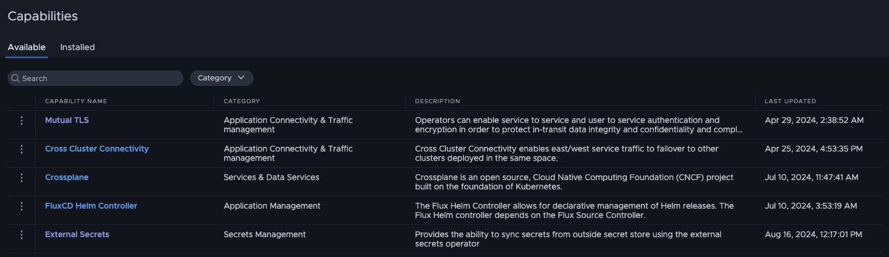

# Installing custom capabilties using a package repo

**This is a workaround until custom capabilties are officially supported. Some of the steps here are not officially supported and may not work over time.** 

This repo is an example of how to use the built in gitops capabilities to register package repositories on cluster groups prior to this functionality being OOTB in the product. This will walk through setting up the gitops syncing at the cluster group level and then creating a package repo that will sync to all clusters. Finally this will use the existing Capabitlies install process to create a capability on a cluster group.

This example already has a pre-created package repo and package. To create your own package repo and packages follow the [carvel docs](https://carvel.dev/kapp-controller/docs/v0.53.x/kctrl-package-authoring/). As a sample package that provides some capabilties we will use external-secrets-operator.

This coud also be used for custom traits.


another approach to this is to follow the steps in this [repo](https://github.com/warroyo/eso-capability) that shows how to create capabilties without carvel packaging


## Setup the TMC plugins to work with Tanzu Platform

This assumes you already have the Tanzu cli and the TMC plugins installed. if not, follow the [docs](https://docs.vmware.com/en/VMware-Tanzu-CLI/index.html) to get that installed.

1. Install [mitmproxy](https://mitmproxy.org/) you will also need to add the mitm proxy [root ca](https://docs.mitmproxy.org/stable/concepts-certificates/) to your system. 
2. get your Tanzu platform project ID -  this can be foudn with `tanzu current context` while connected to a tanzu platform context

3. create a context for the tanzu platform tmc api

```bash
tanzu context create tpk8s-tmc -t tmc --endpoint tmc.tanzu.cloud.vmware.com
```


4. run the mitmproxy with a setting to also re-write headers

```bash
mitmdump --modify-headers "/X-Project-Id/your-project-id"
```


5. in another terminal window set your proxy and use the cli

```bash
export HTTPS_PROXY=localhost:8080

tanzu tmc cluster list

```


## Enable Flux and sync the package repo

This step will sync the package repo resources from the `package-repos` folder .


1. enable TMC CD

```bash
tanzu tmc continuousdelivery enable -g your-cg -s clustergroup
```

2. create a git repo

```bash

 ytt -f tpk8s-resources/gitrepo.yml -v cg=your-cg -v gitrepo=https://github.com/warroyo/tpk8s-custom-capabilities | tanzu tmc continuousdelivery gitrepository create -s clustergroup -f-
```


3. create a kustomization

```bash
 ytt -f tpk8s-resources/kustomization.yml -v cg=your-cg  | tanzu tmc continuousdelivery kustomization create -s clustergroup -f-
 ```

At this point the package repo should sync into all clusters in the cluster group. This step is what allows us to work around the limitation of syncing of `pkgrs` today.

## Add the package repo to the Tanzu Platform cluster group

This step is needed becuase our platform needs to also be aware of the package repo. After adding this the packages can be installed normally.


1. target your tanzu platform project

```bash
tanzu project use your-proj
```

2. apply the package repo 

```
tanzu package repository add custom-cap-repo --url ghcr.io/warroyo/tpk8s-custom-capabilities/custom-cap-repo:1.0.0
```

at this point you should see the capability in the UI and be able to install it following the normal process for any capability



## Creating custom packages

in order for the package to show up in the list of available capabilties you need to add a label and some annotations

here is the example from this repo

```yaml
labels:
    spaces.tanzu.vmware.com/package-ref: external-secrets.external-secrets.io
annotations:
    capability.tanzu.vmware.com/provides: |-
        [{
        "name": "external-secrets.external-secrets.io",
        "displayName": "External Secrets",
        "description": "Provides the ability to sync secrets from outside secret store using the external secrets operator",
        "vendor": "External Secrets",
        "tags": [ "Secrets Management" ],
        "groupVersionKinds": [
            { "apiVersion": " external-secrets.io/v1beta1", "kind": "ExternalSecret" },
            { "apiVersion": " external-secrets.io/v1beta1", "kind": "SecretStore" }
        ]
        }]
```